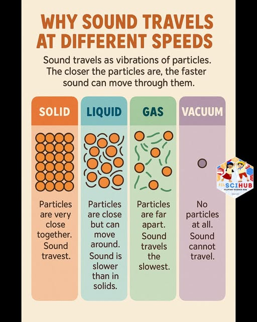

# 🔊 Acoustics: Speed of Sound in Various Media

This module provides a comprehensive computational tool to determine the **Speed of Sound** ($v$) across different states of matter: Solids, Liquids, and Gases. It demonstrates how acoustic velocity is a function of a medium's elastic properties and density.

## 🧪 Scientific Overview

The speed of sound is not constant; it depends on the elastic modulus and the density of the medium through which the longitudinal wave travels.

### 1. In Solids
Sound speed depends on the stiffness (Young's Modulus) of the material:
$$v = \sqrt{\frac{Y}{\rho}}$$

### 2. In Liquids
In fluids, the speed depends on the material's resistance to compression (Bulk Modulus):
$$v = \sqrt{\frac{B}{\rho}}$$

### 3. In Gases (Newton-Laplace Equation)
For gases, the speed is determined by the adiabatic index and pressure:
$$v = \sqrt{\frac{\gamma P}{\rho}}$$

Where:
* **$v$:** Speed of sound ($m/s$).
* **$\rho$ (rho):** Density of the medium ($kg/m^3$).
* **$Y$:** Young's Modulus (for solids).
* **$B$:** Bulk Modulus (for liquids).
* **$\gamma$ (gamma):** Adiabatic index ($C_p/C_v$).
* **$P$:** Pressure ($Pa$).

## 💻 Logic & Implementation
This script uses an advanced conditional architecture to apply the correct physical laws:
* **Phase-Specific Functions:** Features modular functions `Sound_Speed_Solid`, `Sound_Speed_Liquid`, and `Sound_Speed_Gas`.
* **Interactive Medium Selection:** A menu-driven interface guides the user to provide the specific constants required for their chosen phase.
* **Error Handling:** Robust `try-except` blocks prevent crashes from non-numeric inputs, and range-checking ensures valid menu selection.
* **Technical Insights:** Includes a reminder that sound speed in gases is significantly temperature-dependent.

## 🚀 Usage
1. **Select Medium:** Choose `1` (Solid), `2` (Liquid), or `3` (Gas).
2. **Input Density:** Enter the density of the medium in $kg/m^3$.
3. **Input Modulus/Index:** Provide the required elastic constant ($Y$, $B$, or $\gamma$) as prompted.

---

### 📂 Source Code
You can view and download the full Python script here:  
**[👉 speed_of_sound_in_media.py](./speed_of_sound_in_media.py)**

---
*Developed by vedika_apte | M.Sc. Physics | Python Developer*

*Part of the Physics Python Tools Gallery*
