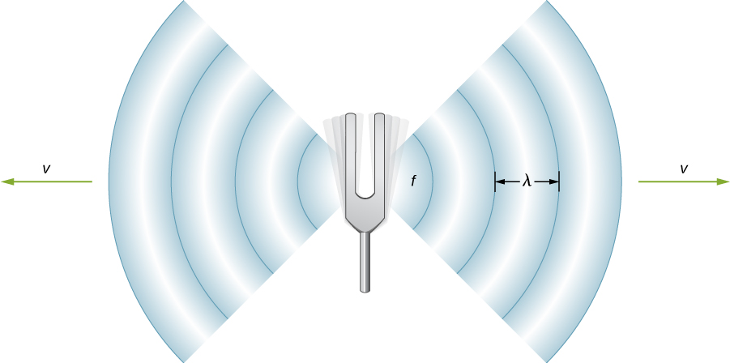

# 🔊 Acoustics: Wave Speed & Frequency Calculator

This module provides a dual-stage computational tool to determine the **Frequency** ($f$) and **Propagation Speed** ($v$) of a sound wave. It serves as a practical application of wave mechanics using Python's functional programming.

## 🧪 Scientific Overview

A sound wave is a longitudinal wave that travels through a medium. Its behavior is characterized by its periodicity and the relationship between its physical dimensions and its speed.

### 1. Frequency Derivation
The frequency represents the number of cycles per unit of time and is the reciprocal of the time period ($T$):
$$f = \frac{1}{T}$$

### 2. The Wave Equation
The speed of a wave is determined by the product of its wavelength and its frequency:
$$v = \lambda \times f$$

Where:
* **Speed ($v$):** Velocity of the wave in the medium ($m/s$).
* **Wavelength ($\lambda$):** The distance between successive crests or compressions ($m$).
* **Frequency ($f$):** The number of oscillations per second ($Hz$).
* **Time Period ($T$):** The time taken for one complete cycle ($s$).

## 💻 Logic & Implementation
This script implements a clear, sequential physics workflow:
* **Two-Phase Calculation:** Features independent functions `Freq` and `Wave_Speed` to handle different stages of wave analysis.
* **Input Validation:** Uses `try-except` blocks to manage non-numeric inputs, ensuring the program remains stable during user interaction.
* **Physical Constraints:** Includes safety checks to prevent division by zero (Time Period = 0) and validates that wavelength and frequency are non-zero for meaningful speed results.
* **Modular Design:** Each function is defined to allow for easy scaling or integration into larger acoustics projects.

## 🚀 Usage
The script runs in two distinct parts:
1.  **Frequency Analysis:** Enter the **Time Period ($s$)** to calculate the frequency in Hertz ($Hz$).
2.  **Velocity Analysis:** Enter the **Wavelength ($m$)** and **Frequency ($Hz$)** to determine the final Speed of Sound ($m/s$).

---

### 📂 Source Code
You can view and download the full Python script here:  
**[👉 speed_of_sound.py](./speed_of_sound.py)**

---
*Developed by vedika_apte | M.Sc. Physics | Python Developer*

*Part of the Physics Python Tools Gallery*
