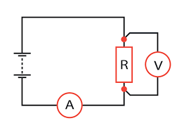

# ⚡ Electricity: Circuit Power & Resistance Calculator

This module provides a dual-purpose computational tool to determine the **Electric Power** ($P$) and **Resistance** ($R$) of a circuit. It demonstrates the application of Joule's Law and Ohm's Law using Python's functional programming.

## 🧪 Scientific Overview

In an electrical circuit, power represents the rate at which electrical energy is transferred by an electric circuit. Resistance, on the other hand, is the measure of the opposition to current flow.

### 1. Joule's Law (Power)
Power can be calculated using different parameters depending on the known variables:
* **Using Voltage and Current:** $$P = V \times I$$
* **Using Current and Resistance:** $$P = I^2 \times R$$

### 2. Ohm's Law (Resistance)
The relationship between voltage, current, and resistance is defined as:
$$R = \frac{V}{I}$$

Where:
* **Power ($P$):** Measured in Watts ($W$).
* **Voltage ($V$):** Measured in Volts ($V$).
* **Current ($I$):** Measured in Amperes ($A$).
* **Resistance ($R$):** Measured in Ohms ($\Omega$).

## 💻 Logic & Implementation
This script implements robust engineering logic:
* **Multi-Formula Support:** Independent functions for `Power_VI`, `Power_IR`, and `Ohms_Law`.
* **Error Handling:** Uses `try-except` blocks to catch non-numeric inputs and ensures program continuity.
* **Safety Constraints:** Includes validation to prevent division by zero (Current = 0) and filters for positive values to maintain physical relevance.
* **Unicode Support:** Correctly renders the Omega symbol ($\Omega$) in the output for professional formatting.

## 🚀 Usage
The script runs in two phases:
1.  **Phase 1:** Enter **Voltage** and **Current** to find the Power ($V \times I$) and Resistance ($\Omega$).
2.  **Phase 2:** Enter **Current** and **Resistance** to calculate Power ($I^2 \times R$).

---

### 📂 Source Code
You can view and download the full Python script here:  
**[👉 power_of_dc_circuit.py](./power_of_dc_circuit.py)**

---
*Developed by vedika_apte | M.Sc. Physics | Python Developer*

*Part of the Physics Python Tools Gallery*

