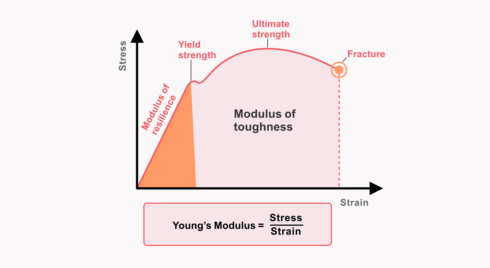

# 🏗️ Mechanics: Young's Modulus Calculator

This module provides a robust computational tool to determine the **Young's Modulus** ($E$) of a material. It serves as a practical application of material science constants using Python's functional programming.

## 🧪 Scientific Overview

Young's Modulus is a fundamental property that measures the stiffness of a solid material. It is defined as the ratio of tensile stress to tensile strain:

$$E = \frac{\sigma}{\epsilon}$$

Where:
* **Stress ($\sigma$):** Force applied per unit area ($F/A$).
* **Strain ($\epsilon$):** Ratio of change in length to original length ($\Delta L/L_0$).

## 💻 Logic & Implementation
This script demonstrates high-level programming practices:
* **Function-Based Design:** Independent functions for `Stress`, `Strain`, and `Young_Modulus`.
* **Input Validation:** Converts user input to floats and handles non-numeric errors using `try-except` blocks.
* **Safety Constraints:** Checks for zero-division errors (Area = 0 or Length = 0) before performing calculations.

## 🚀 Usage
Run the script and enter the following parameters when prompted:
1. Applied Force ($N$)
2. Cross-sectional Area ($m^2$)
3. Original Length ($m$)
4. New Length after deformation ($m$)

---
### 📂 Source Code
You can view and download the full Python script here: 
**[👉 youngs_modulus.py](./youngs_modulus.py)**
---
*Part of the Physics Python Tools Gallery*
