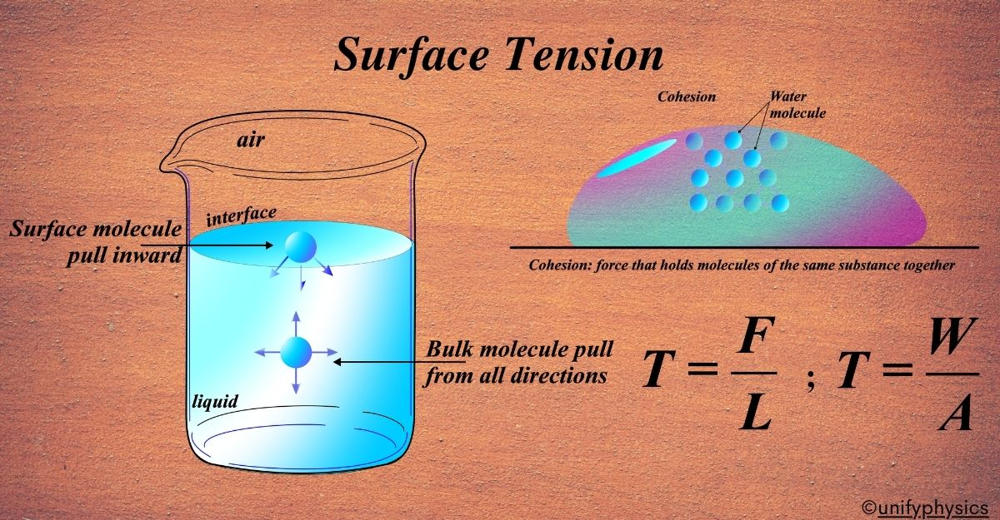

# 💧 Mechanics: Surface Tension Calculator

This module provides a computational tool to determine the **Surface Tension** ($T$) of a liquid. It is a key project within my Physics-Python Gallery, demonstrating fluid mechanics analysis using Python.

## 🧪 Scientific Overview

Surface tension is the tendency of liquid surfaces at rest to shrink into the minimum surface area possible. It is caused by cohesive forces between liquid molecules.

### The Formula
The surface tension ($T$) is defined as the force ($F$) exerted parallel to the surface of the liquid per unit length ($L$):

$$T = \frac{F}{L}$$

Where:
* **Force ($F$):** Measured in Newtons ($N$).
* **Length ($L$):** The line of contact over which the force acts, measured in meters ($m$).
* **Unit:** The resulting Surface Tension is expressed in $N/m$.

## 💻 Logic & Implementation
This script follows clean coding standards for scientific computing:
* **Error Handling:** Uses `try-except` blocks to manage non-numeric inputs.
* **Safety Logic:** Includes an `if-else` check to prevent division-by-zero errors if the length is entered as 0.
* **Precision:** Returns floating-point results for high-accuracy physics calculations.

## 🚀 Usage
1. Run `surface_tension.py`.
2. Input the force exerted by the liquid.
3. Input the contact length.
4. The tool will output the Surface Tension in $N/m$.

---
### 📂 Source Code
View the full implementation here: 
**[👉 surface_tension.py](./surface_tension.py)**

*Developed by vedika_apte | MSc Physics | Python Developer 

*Part of the Physics Python Tools Gallery*
