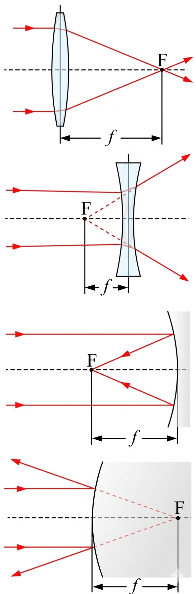

# 👓 Optics: Lens Power Calculator

This module provides a computational tool to determine the **Optical Power** ($P$) of a lens based on its focal length. It serves as a practical application of geometric optics using Python's functional programming.

## 🧪 Scientific Overview

The power of a lens is a measure of the degree of convergence or divergence of light rays falling on it. A lens with a shorter focal length bends light rays more strongly and thus has a higher optical power.

The relationship is defined by the formula:

$$P = \frac{1}{f}$$

Where:
* **Power ($P$):** The optical power, typically measured in Dioptres ($D$) when the focal length is in meters.
* **Focal Length ($f$):** The distance over which initially collimated rays are brought to a focus.

> **Note:** In this specific implementation, the tool calculates power based on centimeters ($1/cm$) for localized laboratory scales.

## 💻 Logic & Implementation
This script follows the established standards of the Physics Python Tools Gallery:
* **Unit Conversion:** Automatically handles the conversion from meters (user input) to centimeters for specific power calculations.
* **Function-Based Design:** Encapsulates the reciprocal relationship in a dedicated `Lens_Power` function.
* **Error Handling:** Uses `try-except` blocks to manage non-numeric inputs and prevent program termination.
* **Safety Constraints:** Validates that the focal length is not zero to avoid mathematical singularities (division by zero).

## 🚀 Usage
Run the script and enter the following parameter when prompted:
1. **Focal Length ($m$):** The measured focal length of the lens in meters.

The program will output the Power of the lens in inverse centimeters ($/cm$).

---

### 📂 Source Code
You can view and download the full Python script here:  
**[👉 power_of_lens.py](./power_of_lens.py)**

---
*Developed by vedika_apte | M.Sc. Physics | Python Developer*

*Part of the Physics Python Tools Gallery*
