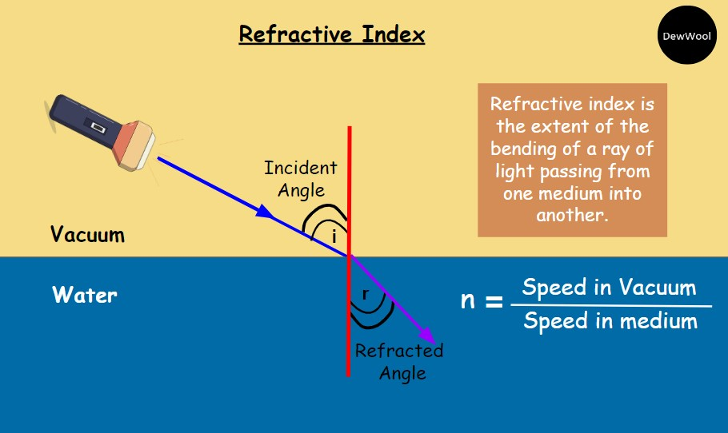

# 🔍 Optics: Refractive Index Calculator

This module provides a precise computational tool to determine the **Refractive Index** ($n$) of a medium. It serves as a practical application of light speed constants and wave behavior using Python's functional programming.

## 🧪 Scientific Overview

The refractive index of a material is a dimensionless number that describes how fast light travels through that medium. It determines how much the path of light is bent, or refracted, when entering a material.

The fundamental formula is:

$$n = \frac{c}{v}$$

Where:
* **Refractive Index ($n$):** A ratio indicating the light-bending capability of the medium.
* **Speed of Light in Vacuum ($c$):** Constant at approximately $3.0 \times 10^8 \, m/s$.
* **Speed of Light in Medium ($v$):** The phase velocity of light in the specific material ($m/s$).

## 💻 Logic & Implementation
This script demonstrates clean and efficient coding practices for optical physics:
* **Function-Based Design:** Features a dedicated `Refractive_Index` function for clarity and modularity.
* **Input Validation:** Implements `try-except` blocks to handle non-numeric data entry gracefully.
* **Physical Constraints:** Includes a safety check to ensure velocity is not zero, preventing division errors and maintaining physical validity.
* **Standard Constants:** Utilizes the scientific constant for the speed of light ($c$) to ensure standardized results.

## 🚀 Usage
Run the script and enter the following parameter when prompted:
1. **Velocity ($m/s$):** The measured speed of light within the medium.

The program will output the refractive index ($n$), relative to the speed of light in a vacuum.

---

### 📂 Source Code
You can view and download the full Python script here:  
**[👉 refractive_index.py](./refractive_index.py)**

---
*Developed by vedika_apte | M.Sc. Physics | Python Developer*

*Part of the Physics Python Tools Gallery*
