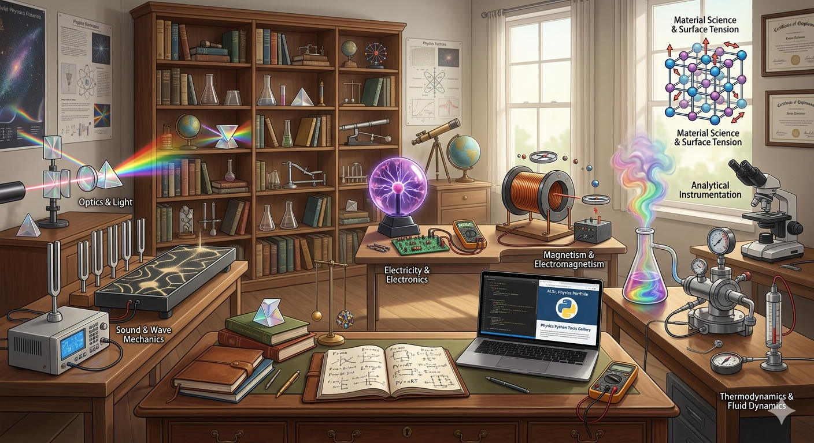

# 🏛️ Physics-Python-Tools: The Computing Gallery

A professional collection of computational tools for Engineering and Physics, developed as part of a Python Technical Portfolio.

### A Computational Approach to Physical Constants & Laws

Welcome to my curated collection of Python-based tools, bridging the gap between **Theoretical Physics** and **Functional Programming**. This gallery transforms complex scientific formulas into interactive, error-resistant software exhibits.

---

## 🏗️ Mechanics Laboratory
*Exploring Material Science and Classical Dynamics.*

* **[Newton's 2nd Law of Motion](https://github.com/VedikaA-work/Physics-Python-Tools/blob/main/Mechanics/Newton's%202nd%20law%20of%20motion/NewtonREADME.md)** Analyzing the relationship between Force, Mass, and Acceleration.
* **[Young's Modulus Module](https://github.com/VedikaA-work/Physics-Python-Tools/blob/main//Mechanics/Young's%20Modulus/YMREADME.md):** Evaluating material stiffness ($E$) and Stress-Strain dynamics.
* **[Surface Tension Module](https://github.com/VedikaA-work/Physics-Python-Tools/blob/main//Mechanics/Surface%20Tension/ST_README.md):** Computing cohesive forces ($\gamma$) acting on liquid interfaces.

---

## ⚡ Electricals Suite
*Precision tools for circuit analysis and electrical engineering.*

* **[Ohm's Law Module](https://github.com/VedikaA-work/Physics-Python-Tools/blob/main//Electricals/Ohm's%20Law/OhmREADME.md):** Calculating the interplay between Voltage ($V$), Current ($I$), and Resistance ($R$).
* **[Power of DC Circuit](https://github.com/VedikaA-work/Physics-Python-Tools/blob/main//Electricals/Power%20of%20DC%20circuit/DCpowerREADME.md):** Comprehensive analysis of power dissipation ($P$) and Joule's Law.

---

## 🔍 Optics Wing
*Analyzing light behavior and geometric properties of lenses.*

* **[Refractive Index](https://github.com/VedikaA-work/Physics-Python-Tools/blob/main//Optics/Refractive%20Index/RIndexREADME.md):** Medium behavior analysis using light-speed ratios ($n$).
* **[Power of Lens](https://github.com/VedikaA-work/Physics-Python-Tools/blob/main//Optics/Power%20of%20lens/PLensREADME.md):** Optical power ($D$) determination from focal length measurements.
---

## 🔊 Acoustics Gallery
*Computational analysis of wave mechanics and sound propagation.*

* **[Speed of Sound Wave](https://github.com/VedikaA-work/Physics-Python-Tools/blob/main//Sound/Speed%20of%20sound/SoundREADME.md):** Frequency, wavelength, and propagation speed calculators.
* **[Speed of Sound in Media](https://github.com/VedikaA-work/Physics-Python-Tools/blob/main//Sound/Speed%20of%20sound%20in%20media/Sound_mediaREADME.md):** Velocity analysis across solids, liquids, and gases.

---

## 🌡️ Thermodynamics Gallery
*Computational tools for heat, energy, and state equations.*

* **[Ideal Gas Module](https://github.com/VedikaA-work/Physics-Python-Tools/blob/main//Thermodynamics/Ideal%20gas/IgasREADME.md):** Determining molar quantities ($n$) using the universal gas equation.
* **[Latent Heat Module](https://github.com/VedikaA-work/Physics-Python-Tools/blob/main//Thermodynamics/Latent%20heat/LHREADME.md):** Calculating energy requirements ($Q$) for Fusion and Vaporization phase changes.

---

## 🛠️ Technical Stack & Core Competencies
* **Scientific Computing:** `Python 3.x` & `Mathematical Logic`.
* **Documentation:** `LaTeX` for high-fidelity scientific rendering.
* **Analytical Expertise:** `Solid State Physics` & `Analytical Instrumentation`.

---
## ✍️ About the Author
**Developed by Vedika Apte** 

* M.Sc. Physics | Python Developer | Freelance Pitch Deck Expert *

Developing tools that simplify complex physical calculations through clean, efficient code. This gallery is a testament to the intersection of scientific rigor and modern programming.

---
*© 2026 Physics Python Tools Gallery*

 

