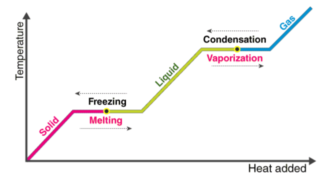

# 🌡️ Thermodynamics: Latent Heat Calculator

This module provides a computational tool to determine the **Total Heat Energy** ($Q$) required for a substance to undergo a phase change. It supports calculations for both **Fusion** (melting) and **Vaporization** (boiling) using Python's functional programming.

## 🧪 Scientific Overview

Latent heat is the energy absorbed or released by a substance during a change in its physical state (phase) that occurs without changing its temperature. 

The fundamental relationship is:

$$Q = m \times L$$

Where:
* **Total Heat Energy ($Q$):** The energy exchanged during the phase change ($J$).
* **Mass ($m$):** The quantity of the substance ($kg$).
* **Specific Latent Heat ($L$):** The heat required per unit mass for the transition ($J/kg$).
    * **Fusion ($L_f$):** Transition between solid and liquid.
    * **Vaporization ($L_v$):** Transition between liquid and gas.

## 💻 Logic & Implementation
This script features an interactive interface designed for thermal analysis:
* **Menu-Driven Logic:** Users select between Fusion and Vaporization paths to apply the correct physical constants.
* **Function-Based Design:** Utilizes modular functions `L_heat_fusion` and `L_heat_vaporization` for clean, reusable code.
* **Input Validation:** Includes range-checking for menu options and `try-except` blocks to handle non-numeric data entry.
* **Scientific Accuracy:** Correctly calculates the total energy ($Q$) while maintaining the distinction between different phase states.

## 🚀 Usage
1. **Choose Phase Change:** Select `1` for Fusion or `2` for Vaporization.
2. **Input Mass:** Enter the mass of your sample in $kg$.
3. **Input Latent Heat Constant:** Provide the specific latent heat value ($L$) for the material.

The program will display the **Total Heat Energy** required for the process in Joules.

---

### 📂 Source Code
You can view and download the full Python script here:  
**[👉 latent_heat.py](./latent_heat.py)**

---
*Developed by vedika_apte | M.Sc. Physics | Python Developer*

*Part of the Physics Python Tools Gallery*
